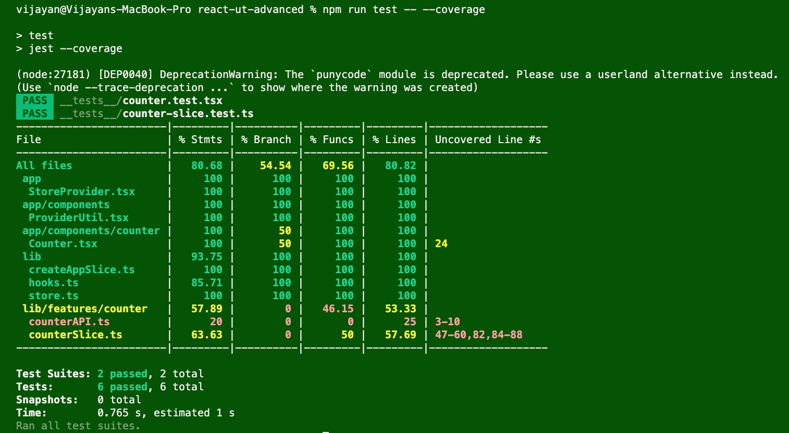

# ReactJS Unit Testing (Advanced)

1. Redux Unit Testing with React Testing Library
2. Redux Unit Testing without UI
3. Demo on End-End Testing with Cypress


***

### 1. Redux Unit Testing with React Testing Library
The Redux Unit Testing is performed with end-end integration with React Application. The unit test case will create a wrapper with Provider and helps for store setup.
Hence testing can be done with user actions through events. Refer counter.test.tsx file

```
npm run test -- counter.test
```
***

### 2. Redux Unit Testing without UI
The Redux unit testing can be done without UI by using the Redux Store. Refer counter-slice.test.ts
```
npm run test -- counter.slice
```


## JEST Code Coverage Report

The code coverage can be achieved with below command

```
npm run test -- --coverage
```
### 1. JEST Code Coverage


### 2. Istanbul Code Coverage
The Code coverage report will be generaged in / coverage/Icov-report/index.html


***
## Demo on E2E Testing with Cypress

### Install Cypress

```
npm install cypress --save-dev
npm install --save-dev cypress @testing-library/cypress
```

### Run Cypress for E2E Testing

Step 1: Run Web Server

```
npm run dev
```

Step 2: Launch Cypress console

```
npx cypress open
```
       (or)
```
 npm run cypress:open
```
Step 3: Choose E2E Testing option
Step 4: Choose a Browser (chrome is preferred)
Step 5: Press 'Start E2E Testing in Chrome'
Step 6: Select 'spec.cy.ts' file to run the testing

***
## Debug

Run below command to enable debug mode with chrome browser
```
node --inspect-brk node_modules/.bin/jest --runInBand 
```

Debug with chrome using  chrome://inspect
***